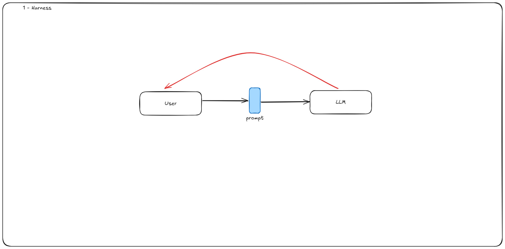
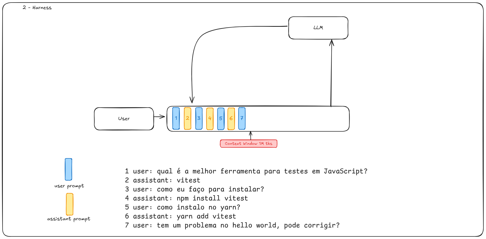
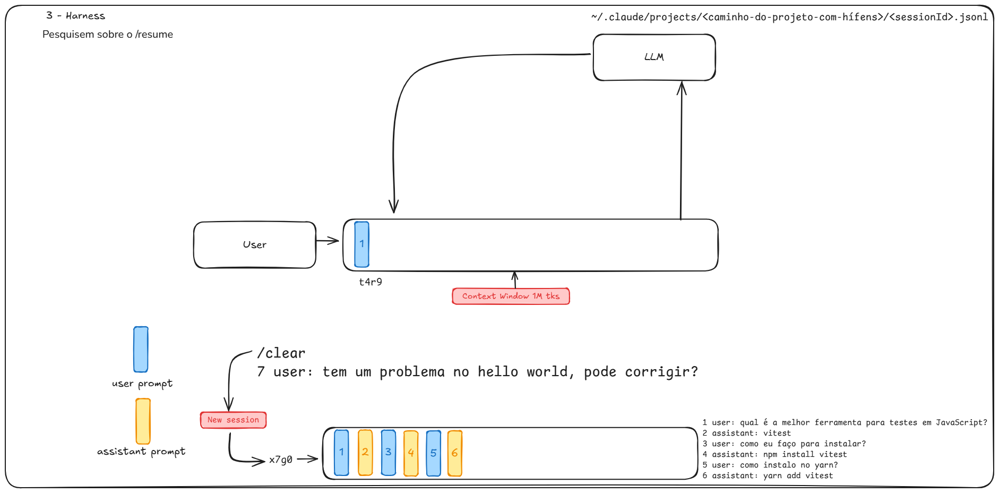
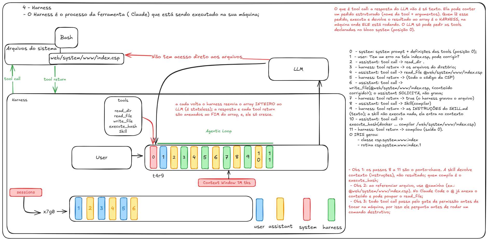

# Harness

Material da apresentação sobre harness. São quatro arquivos TypeScript que constroem
um agente de codificação do zero, cada um acrescentando uma peça do que hoje existe
pronto no Claude Code, no Cursor, no Codex.

A ideia que os quatro passos defendem é a seguinte: o modelo não guarda conversa, não
lê arquivo e não roda comando. Ele recebe texto e devolve texto. Todo o resto (o loop,
o histórico, as ferramentas, os comandos de barra, as sessões) é programa rodando na
sua máquina. Esse programa é o harness.

> Agent = Harness (estrutura) + LLM (cérebro)

Os diagramas de cada passo estão em `docs/`, junto com a fonte editável
`docs/apresentacao.excalidraw`, que abre em [excalidraw.com](https://excalidraw.com).

## Instalando o Bun

O Bun executa TypeScript direto, sem build, sem `ts-node`, e lê o `.env` sozinho. Por
isso o projeto não tem nenhuma dependência de runtime.

No Linux, WSL ou macOS:

```bash
curl -fsSL https://bun.sh/install | bash
source ~/.zshrc   # ou ~/.bashrc; o instalador adiciona ~/.bun/bin ao PATH
bun --version
```

No Windows, via PowerShell:

```powershell
powershell -c "irm bun.sh/install.ps1 | iex"
```

Também dá para instalar com `npm install -g bun`, `brew install oven-sh/bun/bun` ou
`scoop install bun`.

## Configurando

Os tipos são opcionais (os scripts rodam sem eles), mas sem isso o editor reclama:

```bash
bun install
```

A chave da API vai no `.env`, que já está no `.gitignore`:

```bash
cp .env.example .env
```

```
OPENROUTER_KEY=sk-or-v1-...
```

A chave sai de [openrouter.ai/keys](https://openrouter.ai/keys). Não precisa de
`dotenv` nem de `export`; o Bun carrega o arquivo sozinho.

Para rodar, é `bun <arquivo>`. Os passos 2 e 3 saem com `/sair`, o passo 4 com `/bye`,
e o passo 1 termina sozinho:

```bash
bun 1-index.ts
bun 2-index.ts
bun 3-index.ts
bun 4-index.ts
```

## 1-index.ts, a chamada crua



Um `fetch` para o endpoint de responses do OpenRouter, com o prompt fixo no código, e
um `console.log` do JSON que voltou. É o harness mínimo possível, ou quase a ausência
de um.

Duas coisas aparecem aqui. A primeira é que a resposta do modelo não é texto puro: é
um JSON com `output[]`, `reasoning`, `usage`. Vale olhar a saída inteira antes de
seguir. A segunda é que a conversa acaba na primeira resposta, porque o processo
termina.

Repare também que a pergunta traz a conversa embutida na própria string
(`"...Seja objetivo!... Vitest. Como instalar?"`). É a gambiarra que o passo 3 resolve
com um array de mensagens de verdade.

## 2-index.ts, o loop



Entram o `readline` e um `while (true)`. O programa agora fica de pé esperando o
usuário, e é o primeiro momento em que existe um harness no sentido literal: um
processo vivo na máquina, entre você e o modelo.

A frustração aqui é proposital. Pergunte qualquer coisa e, em seguida, pergunte "e
como instalo?". O modelo não faz ideia do que você está falando, porque cada iteração
manda só a string atual. O loop existe, a memória não.

O código também imprime o JSON completo e depois só o `finalAnswer`, o item de
`output[]` com `type === "message"` e `role === "assistant"`. Extrair a resposta de
dentro do envelope já é trabalho do harness.

## 3-index.ts, o contexto



A mudança está em `const messages: Msg[] = []`. A cada volta o harness empurra a
pergunta no array, manda o array inteiro para o modelo e empurra a resposta de volta.
O `input` da API deixa de ser uma string e passa a ser a lista:

```js
messages = [
  { role: "user",      content: "qual a melhor ferramenta de teste?" },
  { role: "assistant", content: "vitest" },
  { role: "user",      content: "como instalo?" },   // agora faz sentido
]
```

Isso é a janela de contexto do diagrama 2. O modelo continua sem memória nenhuma; quem
lembra é o array que vive no harness. E esse array só cresce. Quando ele encosta no
limite da janela, ou você limpa, ou compacta.

É o que explica o `/clear` das ferramentas de verdade, no diagrama 3: limpar é jogar o
array fora e abrir uma sessão nova, não pedir para o modelo esquecer.

## 4-index.ts, o agente



O arquivo principal da apresentação. Junta os três passos anteriores e acrescenta o
que faltava.

O `initContext()` coloca na posição 0 do array uma mensagem `role: "system"` com as
regras do agente: responder em português, só falar de programação, ser objetivo. É a
mesma posição 0 onde entram as definições das tools.

O array `tools` declara uma função `bash`, com nome, descrição e o schema dos
argumentos. A partir daí a resposta do modelo pode conter um item
`type: "function_call"`, que não é texto: é um pedido. O `while (true)` dentro do
`callLLM()` é o agentic loop que atende esse pedido:

```
1. manda messages + tools para o modelo
2. veio function_call?
   sim -> o harness executa (execFileSync bash -lc <command>),
          empurra o function_call e o function_call_output no array,
          e volta para o passo 1
   não -> é a resposta final, devolve para o usuário
```

Esse é o ponto da apresentação inteira. O modelo nunca toca na sua máquina. Ele pede;
quem lista, lê, escreve e compila é o harness, com as permissões do seu usuário e no
seu diretório atual. E ele só consegue pedir aquilo que foi declarado na posição 0.

Uma skill funciona igual, como diz a observação 1 do diagrama 4: ela devolve instruções
para o contexto, não um resultado. Quem executa continua sendo o harness.

Os comandos de barra são a última peça. Todos são tratados no `while` do usuário, com
`continue`, e nenhum chega ao modelo:

| Comando | Efeito |
|---|---|
| `/log` | imprime o JSON bruto da última resposta |
| `/model <id>` | troca o modelo em tempo de execução, e aparece no prompt |
| `/reasoning <low\|medium\|high>` | ajusta o esforço de raciocínio |
| `/context` | mostra o tamanho aproximado do contexto |
| `/clear` | chama `initContext()` e limpa a tela, começando uma sessão nova |
| `/bye` | encerra |

Duas ressalvas sobre esse código, que rendem na hora de apresentar. O `/context` conta
palavras, não tokens: o `getContextSize()` faz `content.split(" ").length` e pula as
mensagens sem `content`, ou seja, ignora justamente o retorno das tools, que costuma
ser a maior parte do contexto. E não existe gate de permissão: o `execFileSync` roda o
comando direto, sem perguntar nada. É de propósito, para contrastar com a observação 3
do diagrama, mas prefira rodar numa pasta descartável.

Um roteiro que funciona bem: peça `liste os arquivos desta pasta`, depois
`tem um problema no helloWorld.js, pode corrigir?`, e acompanhe com `/log` e
`/context` o array crescendo a cada tool call.

## Trocando de modelo

Os quatro arquivos apontam para `openai/gpt-5.6-luna` via OpenRouter. Para trocar,
edite a variável `model` no topo do arquivo ou, no passo 4, use o comando:

```
(openai/gpt-5.6-luna) > /model anthropic/claude-sonnet-5
```

Os passos 1 a 3 só precisam do endpoint de responses. O passo 4 depende também de
suporte a tool calling e ao parâmetro `reasoning`, então confira isso antes de trocar.
Quando a resposta vier estranha, o `/log` mostra o JSON cru; chave inválida e modelo
inexistente aparecem ali como `{ "error": ... }`.

## Os outros arquivos

O `helloWorld.js` é a cobaia do passo 4, um arquivo de brinquedo para o agente ler e
editar via `bash`. O `package.json` declara só `@types/bun` e `typescript`, e o
`tsconfig.json` é o preset que o `bun init` gera. Em `docs/` ficam os quatro diagramas
exportados e o `.excalidraw` que os gerou.
